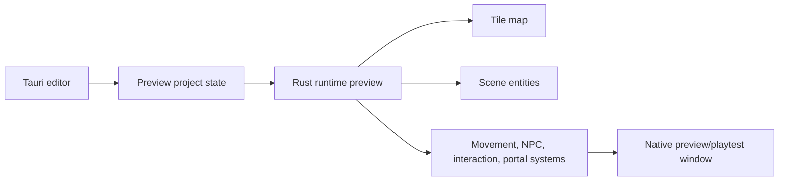

# Scene Composer And Runtime Preview MVP

The first scene composer should prove a creator can place entities into a scene
and run a local playable preview. It should not start as a static placement-only
viewer.

## MVP Slice

The first slice includes:

- One player spawn.
- One controllable player.
- One NPC.
- One NPC behavior: idle or bounded wander.
- One interaction trigger.
- One portal/map transition.

Menus, settings, save/load, dialogue trees, quest logic, and inventory are
explicitly deferred.
The first menu/settings/save-load boundary is documented in
[menus-save-load-after-runtime-preview.md](menus-save-load-after-runtime-preview.md).

## Scene Data

Scene data should reference project assets and maps instead of duplicating them.
The first machine-readable scene format is documented in
[scene-entity-schema-v0.md](scene-entity-schema-v0.md).

Initial entity fields:

- `id`
- `name`
- `assetId`
- `mapId`
- `position`
- `tags`
- `components`

Initial component kinds:

- `playerSpawn`
- `playerController`
- `npcBehavior`
- `interactionTrigger`
- `portalLink`

Component data should remain serializable and editor-friendly.

## Preview Flow

The editor should prepare preview data and launch a Rust-owned local preview.
Rust owns the game loop, simulation, movement, interactions, and map transitions.
The first runtime implementation slice is documented in
[runtime-preview-loop-slice.md](runtime-preview-loop-slice.md).
The first editor placement prototype is documented in
[scene-composer-placement-prototype.md](scene-composer-placement-prototype.md).

## Player Scope

The player controller only needs:

- Spawn at a scene-defined position.
- Move on a grid or simple 2D plane.
- Respect blocking collision regions.
- Activate one nearby interaction trigger.
- Enter one portal trigger.

## NPC Scope

The first NPC behavior only needs one of:

- Idle.
- Bounded wander inside a small region.

No schedules, dialogue trees, pathfinding across maps, or advanced AI in MVP.

## Interaction Trigger Scope

The first interaction trigger can emit:

- A text prompt id.
- An event id.
- A target entity id.

The first runtime behavior can be as small as showing/logging the prompt or
emitting the event to a debug panel.

## Portal Scope

Portal preview should connect to the map portal schema:

- Detect trigger overlap.
- Read target map id and spawn.
- Load/switch to target map.
- Move player to target spawn.
- Apply target facing direction.

Project-level validation for cross-map portal consistency can land separately.

## Follow-Up Issues

- #31: Build scene entity schema V0.
- #32: Build runtime preview loop slice.
- #33: Build scene composer placement prototype.
- #34: Build interaction trigger schema V0.
- #35: Design menus and save/load after the preview loop is stable.
